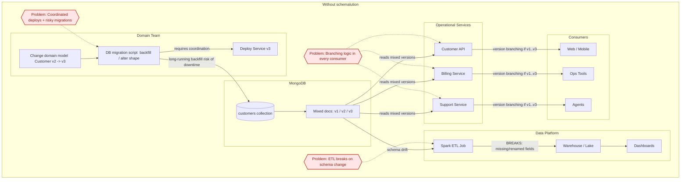
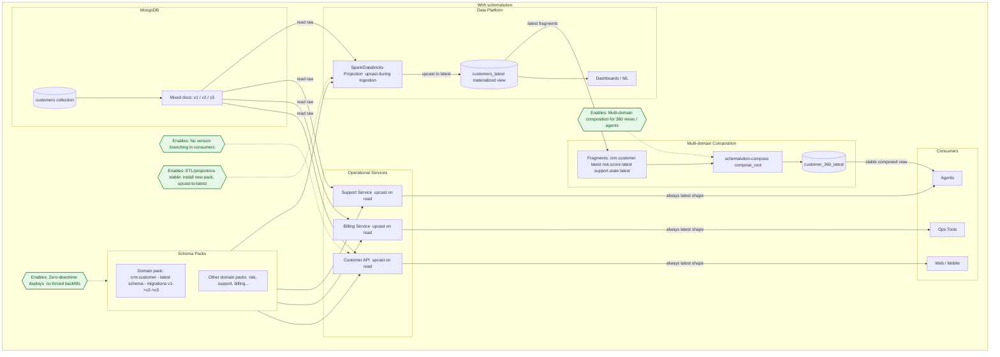

# schemalution
>schemalution turns schema evolution into a first-class architectural capability, enabling systems to evolve continuously without downtime, coordination bottlenecks, or downstream breakage.

## Table of contents

- [What schemalution enables](#what-schemalution-enables)
- [What this unlocks](#what-this-unlocks)
- [Without schemalution: tightly coupled deployments + repeated fixes](#1-without-schemalution-tightly-coupled-deployments--repeated-fixes)
- [With schemalution: decoupled deploys + stable “latest” everywhere](#2-with-schemalution-decoupled-deploys--stable-latest-everywhere)
- [How developers use schemalution (practical guide)](#how-developers-use-schemalution-practical-guide)
- [Repo details](#repo-details)
- [What schemalution is / is not](#what-schemalution-is--is-not)
- [Design principles](#design-principles)
- [Packages](#packages)
- [Core workflow (minimal)](#core-workflow-minimal)
- [Deployment architectures](#deployment-architectures)
- [Repo layout](#repo-layout)
- [End-to-end example: from raw data to composed view](#end-to-end-example-from-raw-data-to-composed-view)
- [Dev setup](#dev-setup)
- [Tests, linting, typing](#tests-linting-typing)
- [Future (grounded)](#future-grounded)

## What schemalution enables

schemalution enables **continuous, zero-downtime evolution of data schemas** across services, pipelines, and domains.

It allows systems to evolve without:
- coordinated deployments,
- blocking data migrations,
- or breaking downstream consumers.

Instead of treating schema changes as one-off operational events, schemalution makes schema evolution a **reusable, deterministic capability**.

---

## What this unlocks

### Zero-downtime deployments
Services can be deployed independently of data migrations.

Old and new records can safely coexist, while application code always operates on a single, canonical “latest” schema.  
This works naturally for:
- rolling deployments,
- multi-tenant SaaS systems,
- large or shared databases.

---

### Stable downstream systems
Schema changes no longer break ETL jobs, analytics pipelines, or projections.

Downstream systems simply:
- install the latest domain schema pack,
- apply upcast-to-latest during ingestion or projection,
- and continue operating on a stable schema shape.

The same evolution logic is reused everywhere—no duplicated migration code.

---

### Independent team and domain evolution
Each domain owns its schema evolution and publishes a stable “latest” interpretation.

Other teams consume that interpretation without coordinating on versions, timelines, or internal changes.  
This enables parallel work across:
- services,
- data platforms,
- and agent-based systems.

---

### Deterministic and auditable data interpretation
Any record, at any version, can be deterministically interpreted as the latest schema.

Schema evolution becomes:
- explicit,
- testable,
- replayable,
- and preserved as code.

This provides long-term confidence in how historical data is understood.

---

### Flexible architecture placement
The same schema evolution logic can be applied:
- inside services (schema-on-read),
- in Spark or Databricks pipelines,
- behind a gateway service,
- during controlled backfills,
- or as part of multi-domain composition.

Architects choose *where* evolution happens without changing *how* it works.

---

## Without schemalution: tightly coupled deployments + repeated fixes



## With schemalution: decoupled deploys + stable “latest” everywhere



# How developers use schemalution (practical guide)

schemalution is intentionally split into a small core and optional boundary adapters.  
Most teams will create **one schema pack per domain** and then reuse it across services and pipelines.

---

## Step 1 — What to install (by project type)

### Domain schema pack (owned by a domain team)
Install:
- `schemalution-core`
- `schemalution-pack`

You create:
- `schemalution-pack-<your-domain>` (your package)

Purpose:
- Defines schema IDs, latest versions, and migrations (upcasters).

---

### API / service (operational read/write)
Install:
- `schemalution-core`
- your domain pack(s) (e.g. `schemalution-pack-crm`)
Optional:
- `schemalution-mongo` (if reading/writing MongoDB)

Purpose:
- Reads records and upcasts to the latest schema on read (or enforces latest on write).

---

### Spark / Databricks pipeline (ETL / projections)
Install:
- `schemalution-core`
- your domain pack(s)
Optional:
- `schemalution-spark`

Purpose:
- Upcasts mixed-version raw data during ingestion/projection to prevent schema breakage.

---

### Projection / composition service (multi-domain “root” views)
Install:
- `schemalution-core`
- domain pack(s)
- `schemalution-compose`

Purpose:
- Combines multiple domain fragments into a stable composed view (e.g., customer 360).

---

## Step 2 — What you build (the packages you create)

A typical organization creates:

1) **Domain schema pack(s)**
- `schemalution-pack-crm`
- `schemalution-pack-billing`
- `schemalution-pack-risk`
Each pack contains:
- `SchemaSpec` (schema_id, latest_version, metadata)
- migrations vN → vN+1
- a `register(registry)` function
- tests + fixtures

2) **(Optional) Contracts package**
- `crm-contracts` (Pydantic models, OpenAPI/JSON Schema)
This stays separate from schemalution:
- schemalution evolves records to “latest”
- Contracts validate/parse “latest”

This separation keeps schemalution framework-agnostic and interoperable.

---

## Step 3 — Who owns what (roles & responsibilities)

### Domain team (schema owners)
Owns:
- the domain schema pack (`schemalution-pack-<domain>`)
- the meaning of fields and evolution decisions
- migration tests and fixtures
Publishes:
- new pack versions whenever the domain evolves

#### Service teams (consumers)
Own:
- application logic
- where schema evolution runs (read path, write path, gateway)
Consume:
- domain schema packs
Use:
- upcast-to-latest at the boundary, so business logic only sees the latest shape

### Data platform team (ETL / analytics)
Owns:
- projection pipelines (Spark/Databricks)
Consumes:
- the same domain schema packs
Uses:
- upcast during ingestion/projection to keep pipelines stable even when schemas evolve

### Platform/architecture (optional, in larger orgs)
May own:
- a Schema Gateway service (central boundary)
- canonical “latest” projection datasets
- shared data access libraries
schemalution supports all of these without changing core semantics.

---

## Step 4 — The core workflow (always the same)

1) Create a registry
2) Register one or more schema packs
3) Upcast any record to latest
4) (Optional) Validate with your contract model

Example (using the included example pack):

```python
from schemalution_core import MigrationRegistry, upcast_to_latest
from schemalution_pack_example_crm import SCHEMA_ID, register

registry = MigrationRegistry()
register(registry)

record = {"schema_version": 1, "customerId": "c-1", "name": "Ada", "age": "42"}
latest = upcast_to_latest(record, SCHEMA_ID, registry)
```

# Repo details

This repo contains the core engine plus small adapters for common boundaries.
See `docs/architectures.md` for deployment patterns.

## What schemalution is / is not

**schemalution is**
- A deterministic schema evolution engine (dict → dict).
- A way to define migrations per schema ID and upcast records to the latest version.
- A small set of adapters for MongoDB/Spark workflows.

**schemalution is not**
- A database, ORM, or persistence layer.
- A framework that owns your runtime or service boundaries.
- A contract model generator (contracts are separate).

## Design principles

- Deterministic migrations: pure functions, no I/O.
- Packs own domain evolution; core stays dependency-light.
- Upcast-to-latest is the default consumer path.
- Adapters are optional and thin.

## Packages

- `schemalution-core`: Migration registry, upcast helpers, diagnostics, and ops DSL.
- `schemalution-pack`: Minimal helpers for authoring schema packs.
- `schemalution-pack-example-crm`: Example `crm.customer` pack used in tests.
- `schemalution-mongo`: Thin helpers for read/upcast/write against MongoDB.
- `schemalution-spark`: JSON + UDF helpers for projection pipelines.
- `schemalution-compose`: Deterministic fragment composition utilities.

## Core workflow (minimal)

```python
from schemalution_core import MigrationRegistry, upcast_to_latest
from schemalution_pack_example_crm import SCHEMA_ID, register

registry = MigrationRegistry()
register(registry)

record = {"schema_version": 1, "customerId": "c-1", "name": "Ada", "age": "42"}
latest = upcast_to_latest(record, SCHEMA_ID, registry)
```

# Deployment architectures

schemalution supports multiple boundaries without changing core semantics:

- **Embedded Schema-on-Read**: upcast inside services on every read.
- **Canonical Projection**: upcast once into a latest “materialized” store.
- **Schema Gateway**: central service enforces schema upgrades.
- **Write-Latest + Backfill**: writers enforce latest; backfill converges storage.

Details: `docs/architectures.md`.

# Repo layout

```json
packages/
  schemalution-core/
  schemalution-pack/
  schemalution-mongo/
  schemalution-spark/
  schemalution-compose/
  schemalution-pack-example-crm/
```

Each package is independently installable and uses a src/ layout.

# End-to-end example: from raw data to composed view

This short narrative illustrates how schemalution is typically used across multiple boundaries in a real system.

## Scenario

A customer domain evolves over time. Data is stored in MongoDB with mixed schema versions.
Multiple consumers exist:

APIs need the latest customer shape.

Analytics requires a canonical, query-friendly dataset.

A higher-level “customer 360” view combines data from multiple domains.

schemalution is used as the evolution primitive, placed differently at each boundary.

## 1. Raw domain data (mixed versions)

MongoDB contains customer records with different schema versions:

```json
{
  "schema_id": "crm.customer",
  "schema_version": 1,
  "customerId": "c-1",
  "name": "Ada",
  "age": "42"
}
```
The domain pack (schemalution-pack-example-crm) defines how this record evolves to the latest schema.

## 2. Operational read path (Embedded Schema-on-Read)

An API service reads directly from MongoDB and upcasts on read:

```python
from schemalution_core import MigrationRegistry, upcast_to_latest
from schemalution_pack_example_crm import SCHEMA_ID, register

registry = MigrationRegistry()
register(registry)

latest = upcast_to_latest(raw_record, SCHEMA_ID, registry)
```

Inside the service, all logic operates on the latest schema only.
No branching on versions is required.

## 3. Projection pipeline (Canonical Projection)

For analytics and downstream consumers, schema evolution is applied once in a batch or streaming job (e.g. Spark / Databricks):

```python
from schemalution_spark import make_upcast_to_latest_json_udf

upcast_udf = make_upcast_to_latest_json_udf("crm.customer", registry)

df_latest = df_raw.withColumn(
    "latest_json",
    upcast_udf(df_raw["document"])
)
```

The output is written to a canonical “latest” dataset.
Consumers of this dataset do not need schemalution at all.

## 4. Multi-domain composition (Customer 360 view)

Independent domain projections (CRM, risk, support, etc.) are composed into a single root view:

```python
from schemalution_compose import Fragment, compose_root

root = compose_root(
    fragments=[
        Fragment(schema_id="crm.customer", payload=customer_latest),
        Fragment(schema_id="risk.score", payload=risk_latest),
    ],
    root_schema_id="customer.root_360",
)
```

Each fragment remains traceable to its domain, while the root view provides a unified shape for agents, APIs, or reporting.

## What this shows

Schema evolution logic is written once, in schema packs.

The same migrations power: **operational reads**, **projection pipelines**, **multi-domain composition**.

schemalution does not dictate where evolution happens — only how.

This is intentional: schemalution is designed to be placed at the boundary that best fits your architecture.

# Dev setup

From the repo root:

```
make setup
make venv
make sync
```

## Tests, linting, typing

```
make lint
make format
make typecheck
make test
```

# Future (grounded)

Automation-friendly tooling is on the roadmap (e.g., helpers to validate packs
and run migrations in batch), but the core stays small and explicit.
