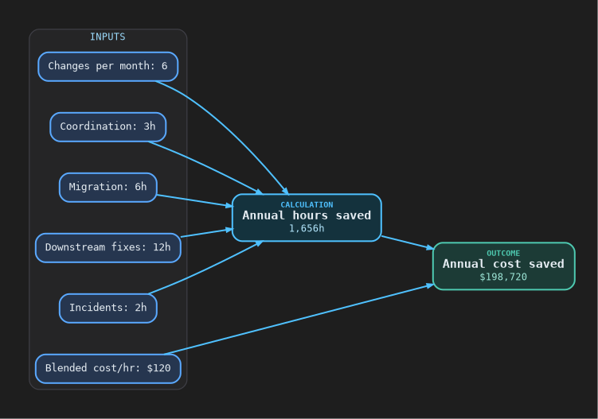
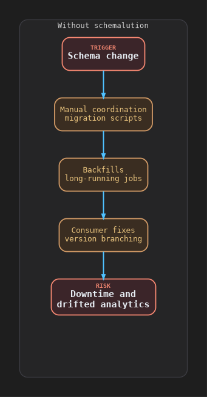
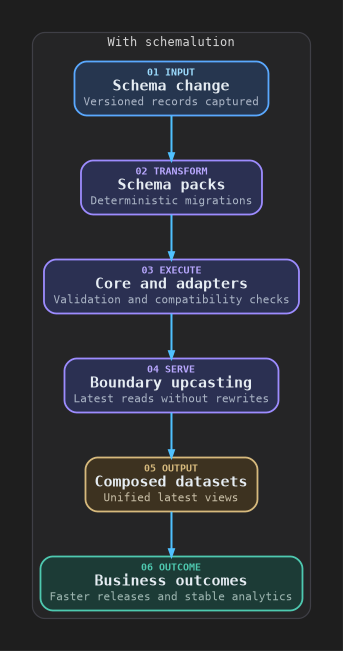
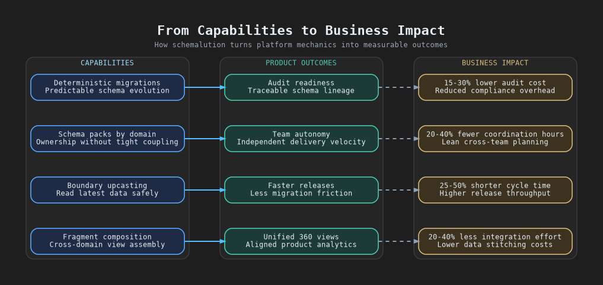

# schemalution
> schemalution turns schema evolution into a first-class architectural capability, enabling systems to evolve continuously without downtime, coordination bottlenecks, or downstream breakage.

## Value
Ship schema changes without downtime, coordination, or broken pipelines.  
schemalution turns schema evolution into a reusable capability across services, data platforms, and agents.

<table width="100%">
  <tr>
    <td width="72%" valign="top" align="left">
      <picture>
        <source media="(max-width: 768px)" srcset="assets/diagrams/economic-value-mobile.svg">
        
      </picture>
    </td>
    <td width="28%" valign="top">
      <table>
        <tr>
          <th>Assume</th>
          <th>Then</th>
        </tr>
        <tr>
          <td>6 changes / month<br>3 + 6 + 12 + 2 = 23h / change<br>$120 / hour</td>
          <td>1,656h saved / year<br>$198,720 saved / year<br>6 x 12 x 23; 1,656 x $120</td>
        </tr>
      </table>
    </td>
  </tr>
</table>

Use this as a baseline; many teams could see additional upside from avoided delays, incident risk, and reduced cross-team coordination.

## What It Enables
| Enablement Area | Practical Result |
| --- | --- |
| Delivery speed | Faster releases without waiting on migration windows |
| Data and AI stability | Stable analytics and AI even as schemas evolve |
| Team operating model | Team autonomy through per-domain schema packs |
| Governance and compliance | Auditability via deterministic, testable evolution paths |
| Runtime simplicity | Business logic that only sees the latest schema shape |

## Value Flow
<table>
  <tr>
    <td width="50%" valign="top">
      <picture>
        <source media="(max-width: 1100px)" srcset="assets/diagrams/value-flow-without-mobile.svg">
        
      </picture>
    </td>
    <td width="50%" valign="top">
      <picture>
        <source media="(max-width: 1100px)" srcset="assets/diagrams/value-flow-with-mobile.svg">
        
      </picture>
    </td>
  </tr>
</table>

## Quick Start (Minimal)
The core workflow is always the same.
1. Create a registry.
2. Register one or more schema packs.
3. Upcast any record to the latest schema.

```python
from schemalution_core import MigrationRegistry, upcast_to_latest
from schemalution_pack_example_crm import SCHEMA_ID, register

registry = MigrationRegistry()
register(registry)

record = {"schema_version": 1, "customerId": "c-1", "name": "Ada", "age": "42"}
latest = upcast_to_latest(record, SCHEMA_ID, registry)
```

## How It Works

Define schema packs → upcast to latest at your boundary → reuse everywhere.

| What schemalution is | What schemalution is not |
| --- | --- |
| A deterministic schema evolution engine (dict → dict) | A database, ORM, or persistence layer |
| A way to define migrations per schema ID and upcast records to latest | A framework that owns your runtime or service boundaries |
| A small set of adapters for MongoDB and Spark workflows | A contract model generator (contracts are separate) |

### Design Principles
- Deterministic migrations: pure functions, no I/O.
- Packs own domain evolution; core stays dependency-light.
- Upcast-to-latest is the default consumer path.
- Adapters are optional and thin.

### Packages
- `schemalution-cli`: CLI for registry export, upcast, and validate.
- `schemalution-core`: Migration registry, upcast helpers, diagnostics, and ops DSL.
- `schemalution-pack`: Minimal helpers for authoring schema packs.
- `schemalution-pack-example-crm`: Example `crm.customer` pack used in tests.
- `schemalution-mongo`: Thin helpers for read/upcast/write against MongoDB.
- `schemalution-spark`: JSON + UDF helpers for projection pipelines.
- `schemalution-compose`: Deterministic fragment composition utilities.

### Example: Projection Pipeline (Spark / Databricks)
```python
from schemalution_spark import make_upcast_to_latest_json_udf

upcast_udf = make_upcast_to_latest_json_udf("crm.customer", registry)

df_latest = df_raw.withColumn(
    "latest_json",
    upcast_udf(df_raw["document"])
)
```

### Example: Multi-domain Composition
```python
from schemalution_compose import Fragment, compose_root

root = compose_root(
    fragments=[
        Fragment(schema_id="crm.customer", payload=customer_latest),
        Fragment(schema_id="risk.score", payload=risk_latest),
    ],
    root_schema_id="customer.root_360",
)
```

## Core Capabilities
| | |
| --- | --- |
| Deterministic migrations (pure functions) | Enables auditability and repeatable evolution |
| Schema packs per domain | Supports team autonomy and reuse across services |
| Upcast-to-latest at boundaries | Keeps business logic on a single latest schema shape |
| Optional adapters (MongoDB, Spark) | Stabilizes projections and analytics workflows |
| Fragment composition (`schemalution-compose`) | Enables multi-domain 360 views |

<picture>
  <source media="(max-width: 768px)" srcset="assets/diagrams/capabilities-outcomes-mobile.svg">
  
</picture>

## Use Cases and Challenges
| Typical Use Cases / Scenarios | Challenges It Solves |
| --- | --- |
| Embedded schema-on-read inside services for always-latest business logic<br>Canonical projection to materialize latest datasets for analytics and ML<br>Multi-domain composition for customer-360 style views and agents<br>Schema gateway for centralized enforcement of latest schemas<br>Write-latest + backfill where writers enforce latest and storage converges | Coordination bottlenecks for schema changes across teams<br>Long-running backfills and tightly coupled deployments<br>Version-branching logic duplicated across consumers<br>Schema drift in pipelines and analytics<br>Inconsistent interpretation of historical data |

## CLI (JSON I/O)
The `schemalution` CLI exposes registry export, upcast, and validate as deterministic JSON I/O.

Install:
```bash
pip install schemalution-cli
pip install schemalution-pack-example-crm
```

If you're working from this repo:
```bash
pip install -e packages/schemalution-cli
pip install -e packages/schemalution-pack-example-crm
```

Quick start with an environment variable:
```bash
export SCHEMALUTION_PACKS=schemalution_pack_example_crm
schemalution registry export --format v1
```

```bash
schemalution registry export --pack schemalution_pack_example_crm --format v1

echo '{"schema_version": 1, "name": "Ada"}' | \
  schemalution upcast --schema-id crm.customer --pack schemalution_pack_example_crm --format v1

echo '{"schema_version": 1, "name": "Ada"}' | \
  schemalution validate --schema-id crm.customer --pack schemalution_pack_example_crm --format v1
```

You can also provide packs via `SCHEMALUTION_PACKS` (comma-separated module names).  
`validate` currently checks that a record can be deterministically upcast to latest; it does not enforce domain contracts yet.  
Output schema (v1): `docs/cli/format-v1.schema.json`.

## Docs, Contributing, License

### Docs

```bash
docs/
```

### Contributing
```bash
make setup
make venv
make sync
```

### Tests, Linting, Typing
```bash
make lint
make format
make typecheck
make test
```

### License
- `LICENSE`
