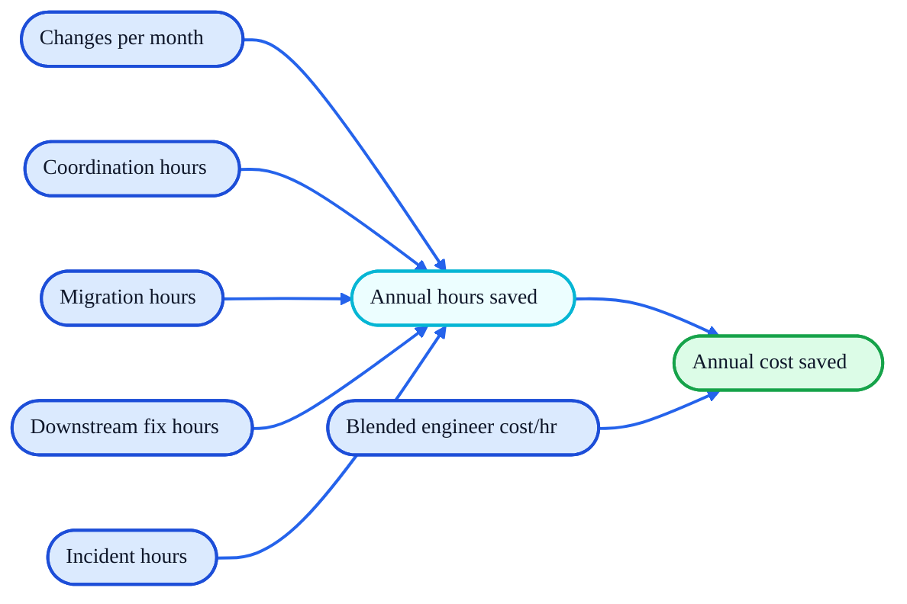
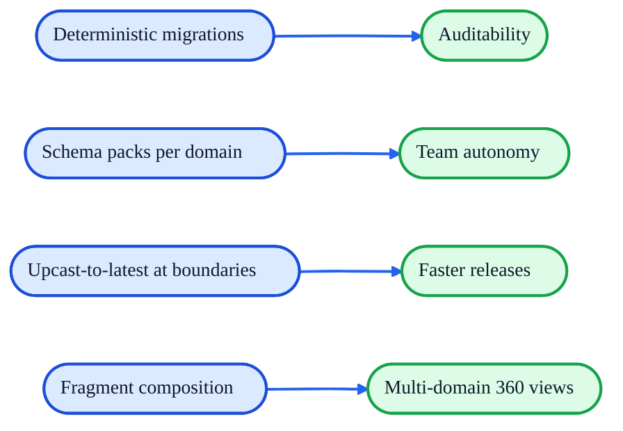

# schemalution
> schemalution turns schema evolution into a first-class architectural capability, enabling systems to evolve continuously without downtime, coordination bottlenecks, or downstream breakage.

## Value Proposition
Ship schema changes without downtime, coordination, or broken pipelines.  
schemalution turns schema evolution into a reusable capability across services, data platforms, and agents.

## Economic Value
Make the benefits concrete by quantifying time saved per schema change and translating that into dollars.

### Economic Value Model (Illustration)


### Example (Illustrative)
Assume:
- 6 schema changes per month
- 3h coordination + 6h migration + 12h downstream fixes + 2h incident time per change
- $120 blended engineer cost/hr

Then:
- Hours saved per change = 23h
- Annual hours saved = `6 * 12 * 23 = 1,656h`
- Annual cost saved = `1,656h * $120/hr = $198,720`

Schemalution reduces each bucket by turning schema evolution into deterministic, reusable code.

## What It Enables
- Faster releases without waiting on migration windows.
- Stable analytics and AI even as schemas evolve.
- Team autonomy through per-domain schema packs.
- Auditability via deterministic, testable evolution paths.
- Business logic that only sees the latest schema shape.

## Value Flow

```mermaid
%%{init: {'theme': 'base', 'themeVariables': {'primaryColor': '#E6F4FF', 'primaryTextColor': '#0F172A', 'primaryBorderColor': '#1D4ED8', 'lineColor': '#2563EB', 'secondaryColor': '#F1F5F9', 'tertiaryColor': '#E2E8F0', 'edgeLabelBackground': '#F8FAFC', 'fontFamily': 'Inter, system-ui, sans-serif', 'fontSize': '14px'}}}%%
flowchart LR
  A([Schema changes + versioned records]) --> B([Schema packs + migrations])
  B --> C([schemalution core + adapters])
  C --> D([Upcast to latest at boundaries])
  D --> E([Latest datasets + composed views])
  E --> F([Faster releases + stable analytics])

  classDef input fill:#DBEAFE,stroke:#1D4ED8,stroke-width:2px,color:#0F172A;
  classDef engine fill:#E0E7FF,stroke:#4338CA,stroke-width:2px,color:#0F172A;
  classDef output fill:#FEF3C7,stroke:#F59E0B,stroke-width:2px,color:#0F172A;
  classDef outcome fill:#DCFCE7,stroke:#16A34A,stroke-width:2px,color:#0F172A;

  class A input;
  class B,C,D engine;
  class E output;
  class F outcome;

  linkStyle default stroke-width:2px;
```


## Core Capabilities → Outcomes
- Deterministic migrations (pure functions) → auditability and repeatable evolution.
- Schema packs per domain → team autonomy and reuse across services.
- Upcast-to-latest at boundaries → business logic only sees the latest schema.
- Optional adapters (MongoDB, Spark) → stable projections and analytics.
- Fragment composition (`schemalution-compose`) → multi-domain 360 views.

## Capabilities → Outcomes Map


## Quick Start (Minimal)
The core workflow is always the same.
1. Create a registry.
2. Register one or more schema packs.
3. Upcast any record to the latest schema.

```python
from schemalution_core import MigrationRegistry, upcast_to_latest
from schemalution_pack_example_crm import SCHEMA_ID, register

registry = MigrationRegistry()
register(registry)

record = {"schema_version": 1, "customerId": "c-1", "name": "Ada", "age": "42"}
latest = upcast_to_latest(record, SCHEMA_ID, registry)
```

## Typical Use Cases / Scenarios
- Embedded Schema-on-Read inside services for always-latest business logic.
- Canonical Projection to materialize the latest datasets for analytics and ML.
- Multi-domain composition for “customer 360” style views and agents.
- Schema Gateway for centralized enforcement of the latest schemas.
- Write-Latest + Backfill where writers enforce the latest and storage converges.

## Challenges It Solves (Secondary)
- Coordination bottlenecks for schema changes across teams.
- Long-running backfills and tightly coupled deployments.
- Version-branching logic duplicated across consumers.
- Schema drift in pipelines and analytics.
- Inconsistent interpretation of historical data.

## How It Works / Concepts

### How it works (one line)
Define schema packs → upcast to latest at your boundary → reuse everywhere.

### What schemalution is
- A deterministic schema evolution engine (dict → dict).
- A way to define migrations per schema ID and to upcast records to the latest version.
- A small set of adapters for MongoDB/Spark workflows.

### What schemalution is not
- A database, ORM, or persistence layer.
- A framework that owns your runtime or service boundaries.
- A contract model generator (contracts are separate).

### Design Principles
- Deterministic migrations: pure functions, no I/O.
- Packs own domain evolution; core stays dependency-light.
- Upcast-to-latest is the default consumer path.
- Adapters are optional and thin.

### Packages
- `schemalution-cli`: CLI for registry export, upcast, and validate.
- `schemalution-core`: Migration registry, upcast helpers, diagnostics, and ops DSL.
- `schemalution-pack`: Minimal helpers for authoring schema packs.
- `schemalution-pack-example-crm`: Example `crm.customer` pack used in tests.
- `schemalution-mongo`: Thin helpers for read/upcast/write against MongoDB.
- `schemalution-spark`: JSON + UDF helpers for projection pipelines.
- `schemalution-compose`: Deterministic fragment composition utilities.

### Deployment Architectures
- Embedded Schema-on-Read: upcast inside services on every read.
- Canonical Projection: upcast once into a latest “materialized” store.
- Schema Gateway: central service enforces schema upgrades.
- Write-Latest + Backfill: writers enforce latest; backfill converges storage.

### Example: Projection Pipeline (Spark / Databricks)
```python
from schemalution_spark import make_upcast_to_latest_json_udf

upcast_udf = make_upcast_to_latest_json_udf("crm.customer", registry)

df_latest = df_raw.withColumn(
    "latest_json",
    upcast_udf(df_raw["document"])
)
```

### Example: Multi-domain Composition
```python
from schemalution_compose import Fragment, compose_root

root = compose_root(
    fragments=[
        Fragment(schema_id="crm.customer", payload=customer_latest),
        Fragment(schema_id="risk.score", payload=risk_latest),
    ],
    root_schema_id="customer.root_360",
)
```

## CLI (JSON I/O)
The `schemalution` CLI exposes registry export, upcast, and validate as deterministic JSON I/O.

Install:
```bash
pip install schemalution-cli
pip install schemalution-pack-example-crm
```

If you're working from this repo:
```bash
pip install -e packages/schemalution-cli
pip install -e packages/schemalution-pack-example-crm
```

Quick start with an environment variable:
```bash
export SCHEMALUTION_PACKS=schemalution_pack_example_crm
schemalution registry export --format v1
```

```bash
schemalution registry export --pack schemalution_pack_example_crm --format v1

echo '{"schema_version": 1, "name": "Ada"}' | \
  schemalution upcast --schema-id crm.customer --pack schemalution_pack_example_crm --format v1

echo '{"schema_version": 1, "name": "Ada"}' | \
  schemalution validate --schema-id crm.customer --pack schemalution_pack_example_crm --format v1
```

You can also provide packs via `SCHEMALUTION_PACKS` (comma-separated module names).  
`validate` currently checks that a record can be deterministically upcast to latest; it does not enforce domain contracts yet.  
Output schema (v1): `docs/cli/format-v1.schema.json`.

## Repo Layout
```json
packages/
  schemalution-cli/
  schemalution-core/
  schemalution-pack/
  schemalution-mongo/
  schemalution-spark/
  schemalution-compose/
  schemalution-pack-example-crm/
```

## Future (Grounded)
Automation-friendly tooling is on the roadmap (e.g., helpers to validate packs and run migrations in batches), but the core stays small and explicit.

## Docs, Contributing, License

### Docs
- `docs/architectures.md`
- `docs/cli/format-v1.schema.json`

### Contributing
```bash
make setup
make venv
make sync
```

### Tests, Linting, Typing
```bash
make lint
make format
make typecheck
make test
```

### License
- `LICENSE`
